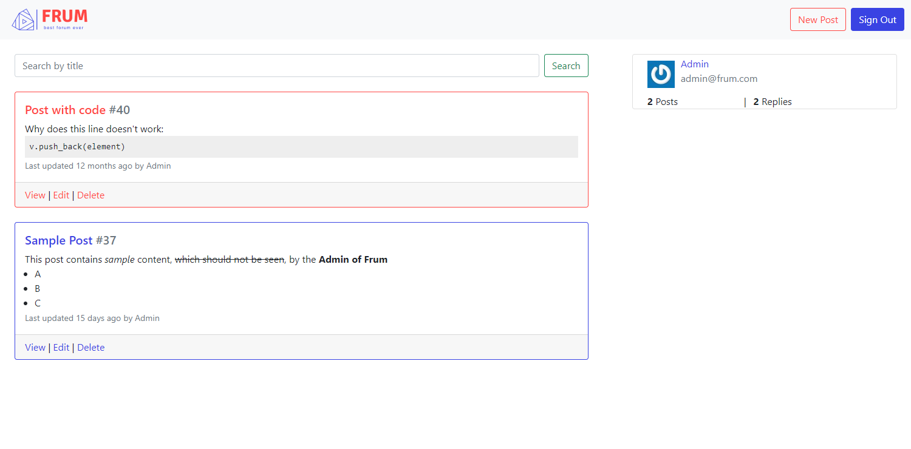

+++
title = "Frum"
description = "A forum built using Ruby on Rails."

# The date of the post.
# Two formats are allowed: YYYY-MM-DD (2012-10-02) and RFC3339 (2002-10-02T15:00:00Z).
# Do not wrap dates in quotes; the line below only indicates that there is no default date.
# If the section variable `sort_by` is set to `date`, then any page that lacks a `date`
# will not be rendered.
# Setting this overrides a date set in the filename.
# date =

# The last updated date of the post, if different from the date.
# Same format as `date`.
# updated =

# The weight as defined on the Section page of the documentation.
# If the section variable `sort_by` is set to `weight`, then any page that lacks a `weight`
# will not be rendered.
weight = 0

# A draft page is only loaded if the `--drafts` flag is passed to `zola build`, `zola serve` or `zola check`.
draft = false

# If set, this slug will be used instead of the filename to make the URL.
# The section path will still be used.
# slug = ""

# The path the content will appear at.
# If set, it cannot be an empty string and will override both `slug` and the filename.
# The sections' path won't be used.
# It should not start with a `/` and the slash will be removed if it does.
# path = ""

# Use aliases if you are moving content but want to redirect previous URLs to the
# current one. This takes an array of paths, not URLs.
aliases = []

# When set to "true", the page will be in the search index. This is only used if
# `build_search_index` is set to "true" in the Zola configuration and the parent section
# hasn't set `in_search_index` to "false" in its front matter.
in_search_index = true

# Template to use to render this page.
template = "project.html"

# The taxonomies for this page. The keys need to be the same as the taxonomy
# names configured in `config.toml` and the values are an array of String objects. For example,
# tags = ["rust", "web"].
[taxonomies]

# Your own data.
[extra]
start_date = 2021-06-01
end_date = 2021-08-01
links = [
    { url = "https://frum.herokuapp.com", name = "Demo" },
    { url = "https://github.com/linhns/frum", name = "GitHub" },
]
+++

### What is it

Frum is a forum-based platform that can be used as a discussion board,
learning Q&A management, and more.

### Tech stack

Frontend: _HTML, CSS, Bootstrap_

Backend: _Ruby on Rails, PostgreSQL_

### Features

- Threaded discussion with replies
- WYSIWYG editor
- Access control

### Implementation

Ruby on Rails was used as the backend to handle user authentication, posts and replies database migrations.
Extra functionalities such as WYSIWYG editor and gravatar were added using Rails plugins and Rubygems.
As security is of high importance, visiting the page will only show a login page and user account must be created by admin.

_Note: Frum is hosted on Heroku and currently use a Heroku Postgres instance. As Heroku is moving its databases to paid tier, it is likely that Frum will not function correctly after November 28, 2022_
