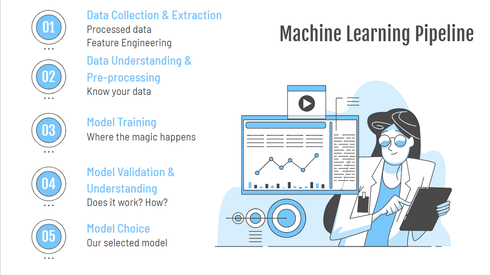

+++
title = "Human Activities Recognition"
description = "Application of well-known machine learning algorithm such as SVM, KNN, Linear Regression, Decision Tree and deep learning models CNN, RNN to predict human activities using sensor data."

# The date of the post.
# Two formats are allowed: YYYY-MM-DD (2012-10-02) and RFC3339 (2002-10-02T15:00:00Z).
# Do not wrap dates in quotes; the line below only indicates that there is no default date.
# If the section variable `sort_by` is set to `date`, then any page that lacks a `date`
# will not be rendered.
# Setting this overrides a date set in the filename.
# date =

# The last updated date of the post, if different from the date.
# Same format as `date`.
# updated =

# The weight as defined on the Section page of the documentation.
# If the section variable `sort_by` is set to `weight`, then any page that lacks a `weight`
# will not be rendered.
weight = 1

# A draft page is only loaded if the `--drafts` flag is passed to `zola build`, `zola serve` or `zola check`.
draft = false

# If set, this slug will be used instead of the filename to make the URL.
# The section path will still be used.
# slug = ""

# The path the content will appear at.
# If set, it cannot be an empty string and will override both `slug` and the filename.
# The sections' path won't be used.
# It should not start with a `/` and the slash will be removed if it does.
# path = ""

# Use aliases if you are moving content but want to redirect previous URLs to the
# current one. This takes an array of paths, not URLs.
aliases = []

# When set to "true", the page will be in the search index. This is only used if
# `build_search_index` is set to "true" in the Zola configuration and the parent section
# hasn't set `in_search_index` to "false" in its front matter.
in_search_index = true

# Template to use to render this page.
# template = "project.html"

# The taxonomies for this page. The keys need to be the same as the taxonomy
# names configured in `config.toml` and the values are an array of String objects. For example,
# tags = ["rust", "web"].
[taxonomies]

# Your own data.
[extra]
start_date = 2021-09-01
end_date = 2021-12-01
technologies = ["Python", "Scikit-learn", "PyTorch", "Numpy", "Pandas", "Tensorflow"]
links = [
    { url = "https://bit.ly/3rKEy5v", name = "Presentation" },
]
short_description = ""
+++

### What I did

My job was to create a data preprocessing pipeline for teammates to follow. I was also responsible for SVM part.

### Implementation

As this was an exploratory project on ML, our group followed the ML Pipeline. Data preprocessing was done using Python libraries including numpy and pandas. For classic models, we used scikit-learn's renowned and robust implementation while both PyTorch and TensorFlow were used due to different member preferences.

You can download the code for this project [here](code.zip)

_Note: This project was done for [CS3244 Machine Learning module](https://nusmods.com/modules/CS3244/machine-learning) in NUS_
